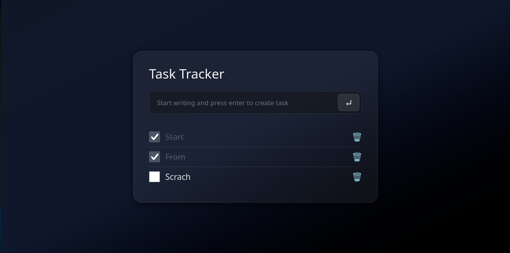

# ⚡ Task Tracker

A sleek, responsive, and lightweight task management application built with **Vanilla JavaScript**, **HTML5**, and **Tailwind CSS**. It provides a clean and interactive experience for creating, completing, and deleting tasks with persistent data storage using **LocalStorage**.



🔗 Live Demo: https://task-tracker-navy-sigma.vercel.app/


---

## ✨ Features

* ➕ **Add Tasks**: Create new tasks by entering a title and pressing enter or clicking the add button.
* ✅ **Complete Tasks**: Mark tasks as completed using the checkbox.
* 🗑️ **Delete Tasks**: Remove tasks from the list with a single click.
* 💾 **LocalStorage**: Automatically saves tasks in the browser's LocalStorage.
* 🔄 **Persistent Data**: Tasks remain available after refreshing or reopening the page.
* 🆔 **Unique Task IDs**: Automatically generates unique IDs for each task.
* 🎨 **Dynamic UI**: Updates the task list and completion states dynamically.
* 📱 **Responsive Design**: Optimized for desktop, tablet, and mobile screens.
* ⚡ **Vanilla JavaScript**: Built without React or other JavaScript frameworks.

---

## 🛠️ Tech Stack

* **HTML5**: Semantic document structure and task form markup.
* **Tailwind CSS**: Utility-first CSS framework for responsive styling and glassmorphism UI.
* **Vanilla JavaScript (ES6+)**: DOM manipulation, event handling, task state management, and LocalStorage integration.
* **LocalStorage API**: Persists task data in the browser.

---

## ⚙️ Functionality

The application allows users to create and manage tasks through a simple and interactive interface.

When a new task is submitted, JavaScript creates a task object containing a unique ID, title, and completion status. The task is then added to the task list and stored in LocalStorage.

Users can mark tasks as completed using the checkbox. The completion state is updated dynamically and saved to LocalStorage.

Tasks can also be deleted from the list, with the updated task collection being automatically saved.

The application loads previously stored tasks from LocalStorage when the page is initialized and renders them to the DOM.

---

## 📁 Project Structure

```text
Task-Tracker/
├── assets/
│   ├── js/
│   │   └── app.js          # Task logic & event handling
│   │
│   └── style/
│       ├── input.css       # Tailwind CSS source file
│       └── output.css      # Compiled CSS stylesheet
│
├── index.html              # Main HTML document
├── package.json            # Project dependencies & scripts
├── package-lock.json       # Dependency lock file
├── preview.png             # Project preview image
└── README.md               # Project documentation
```

---

## 🚀 How It Works

1. Enter a task in the input field.
2. Press enter or click the add button to create the task.
3. The new task is added to the task list.
4. The task is automatically saved to LocalStorage.
5. Use the checkbox to mark a task as completed.
6. Completed tasks receive a visual line-through state.
7. Click the delete button to remove a task.
8. All changes are automatically synchronized with LocalStorage.
9. Previously saved tasks are restored when the application loads.

---

## 🧠 What I Practiced

* DOM selection and manipulation
* Event handling
* Form submission handling
* Array methods such as `map`, `find`, `filter`, and `push`
* Object and array state management
* `JSON.stringify()` and `JSON.parse()`
* Working with the LocalStorage API
* Dynamic HTML rendering
* Template literals
* Managing UI state with JavaScript
* Generating unique IDs
* Building interactive components with Vanilla JavaScript

---

## 📄 License

This project is licensed under the **MIT License**.
